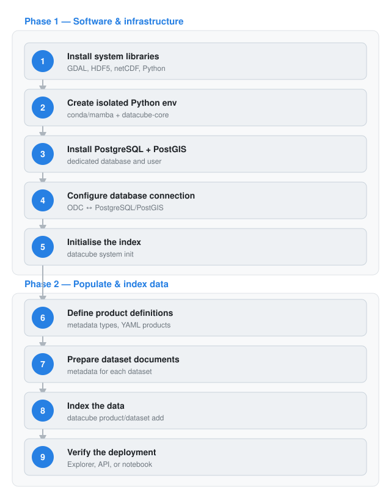

## Setting up the software and infrastructure

Installing a data cube involves two main phases. The first is setting up the underlying software and infrastructure on the machine that will host the cube, typically a server (on-premises or cloud-based) or, for testing and development, a local computer or virtual machine: installing system libraries for handling geospatial formats (GDAL, HDF5, netCDF), a Python environment with the [**Open Data Cube (ODC)**](https://opendatacube.readthedocs.io/en/latest/installation/index.html){target="_blank"} package, and a PostgreSQL/PostGIS database that will hold the index of all available data.

## Populating the cube

Once the software stack is running and connected to its database, the second phase consists of populating the cube: describing the data to be added through **product definitions** and **dataset documents**, then indexing it so it becomes searchable and accessible through the ODC API and tools. Indexing only records metadata about the data; it does not copy, move, or transform the underlying files, making the process fast and safe to repeat.

## Nostradamus installation

For the Nostradamus project, this installation is simplified through a pre-packaged Docker deployment (see [**Nostradamus datacube install**](nostradamus_datacube_setup.qmd){target="_blank"}), which already covers these steps automatically.

The diagram below summarises this workflow; see the [**Quick Start**](dc_quickstart.qmd){target="_blank"} page for the detailed step-by-step instructions.

