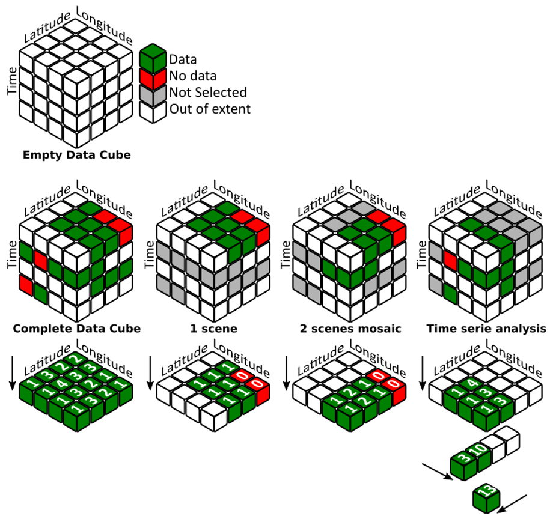

## The problem data cubes solve

Earth observation missions such as [**Landsat**](landsat.qmd){target="_blank"}, [**Sentinel**](sentinel.qmd){target="_blank"}, and [**MODIS**](https://modis.gsfc.nasa.gov/){target="_blank"} now provide multi-decade, continuously growing archives of satellite imagery, but this data has traditionally been organised and distributed scene by scene, requiring heavy preprocessing before it can be compared or combined across dates and sensors. A **data cube** addresses this bottleneck: it provides a common framework to catalogue, access, and analyse large volumes of gridded Earth observation data so that routine, reliable, and reproducible analyses, rather than one-off scene processing, can support evidence-based decisions in areas such as environmental monitoring, agriculture, and land management.

## What a data cube is

Technically, a data cube is an open-source geospatial data management and analysis platform (the **Open Data Cube (ODC)** being the most widely adopted implementation) that organises satellite imagery and other gridded data (elevation models, geophysical grids, model outputs) along space, time, and spectral dimensions. Unlike traditional scene-based approaches, every observation is preserved individually, enabling a shift from scene-based to pixel-based analysis. It exposes this data through a Python API, a catalogue of indexed products, and complementary tools such as the Open Data Cube Explorer, Jupyter notebooks, and OGC web services.

{width="700"}

## Setting up a data cube

Setting up a data cube typically follows a few main steps: selecting and deploying the underlying infrastructure (local, HPC, or cloud) and installing the ODC software stack; defining the interfaces and standards used to describe the data, such as [**STAC**](stac_datastore.qmd){target="_blank"} and OGC web services; preparing and indexing the data (usually **Analysis Ready Data (ARD)**) as datasets and products with standardised metadata; and building a catalogue for discovery, along with the tools (explorer, notebooks, APIs) needed to query, process, and exploit the cube.

## Existing data cube deployments

Several operational data cubes now build on this open-source foundation at different scales, including the [**Swiss Data Cube**](https://www.swissdatacube.org/){target="_blank"}, jointly operated by the University of Geneva, UNEP/GRID-Geneva, the University of Zurich, and the WSL; [**Digital Earth Africa**](https://www.digitalearthafrica.org/){target="_blank"}, delivering continental-scale Earth observation services across Africa; and [**Digital Earth Australia**](https://www.dea.ga.gov.au/){target="_blank"}, run by Geoscience Australia to track more than 30 years of landscape change. The [**Nostradamus datacube**](nostradamus_datacube_intro.qmd){target="_blank"} presented in this site follows the same approach, adapted to the project's agricultural case studies.

Beyond the Open Data Cube itself, other platforms exist for managing and analysing large volumes of Earth observation data (see [**Other datacube platforms**](other_datacube_platforms.qmd){target="_blank"} for an overview).
