# UNIGE & UNEP/GRID-Geneva data cubes Capacity Building


This site is a capacity-building resource on data cubes and Earth observation, developed by UNIGE and UNEP/GRID-Geneva. It introduces the core concepts behind data cubes — what problem they solve, how they organise satellite and geospatial data, and the main steps involved in setting one up — before walking through a concrete, hands-on implementation.

At its core is the Nostradamus datacube, a modified Open Data Cube deployment with a multi-user JupyterHub, an integrated STAC datastore, and ready-to-use notebooks. The site documents how to install and use it, complemented by step-by-step tutorials, recorded workshops, and a parallel section on vector datacubes for non-raster geospatial data.

Beyond the datacube itself, the site catalogues the underlying data sources (Landsat, Sentinel, the Planetary Computer STAC catalog) and the tools used to work with them (Jupyter, LivingEarth), along with acknowledgments and a FAQ for troubleshooting. Use the sidebar to navigate by topic, or start with the [**Introduction to datacubes**](dc_overview.qmd){target="_blank"} for a general overview before diving into the Nostradamus-specific material.





# Introduction to datacubes


Earth observation missions such as [**Landsat**](landsat.qmd){target="_blank"}, [**Sentinel**](sentinel.qmd){target="_blank"}, and [**MODIS**](https://modis.gsfc.nasa.gov/){target="_blank"} now provide multi-decade, continuously growing archives of satellite imagery, but this data has traditionally been organised and distributed scene by scene, requiring heavy preprocessing before it can be compared or combined across dates and sensors. A **data cube** addresses this bottleneck: it provides a common framework to catalogue, access, and analyse large volumes of gridded Earth observation data so that routine, reliable, and reproducible analyses, rather than one-off scene processing, can support evidence-based decisions in areas such as environmental monitoring, agriculture, and land management.

Technically, a data cube is an open-source geospatial data management and analysis platform (the **Open Data Cube (ODC)** being the most widely adopted implementation) that organises satellite imagery and other gridded data (elevation models, geophysical grids, model outputs) along space, time, and spectral dimensions. Unlike traditional scene-based approaches, every observation is preserved individually, enabling a shift from scene-based to pixel-based analysis. It exposes this data through a Python API, a catalogue of indexed products, and complementary tools such as the Open Data Cube Explorer, Jupyter notebooks, and OGC web services.

Setting up a data cube typically follows a few main steps: selecting and deploying the underlying infrastructure (local, HPC, or cloud) and installing the ODC software stack; defining the interfaces and standards used to describe the data, such as [**STAC**](stac_datastore.qmd){target="_blank"} and OGC web services; preparing and indexing the data (usually **Analysis Ready Data (ARD)**) as datasets and products with standardised metadata; and building a catalogue for discovery, along with the tools (explorer, notebooks, APIs) needed to query, process, and exploit the cube.

Several operational data cubes now build on this open-source foundation at different scales, including the [**Swiss Data Cube**](https://www.swissdatacube.org/){target="_blank"}, jointly operated by the University of Geneva, UN Environment/GRID-Geneva, the University of Zurich, and the WSL; [**Digital Earth Africa**](https://www.digitalearthafrica.org/){target="_blank"}, delivering continental-scale Earth observation services across Africa; and [**Digital Earth Australia**](https://www.dea.ga.gov.au/){target="_blank"}, run by Geoscience Australia to track more than 30 years of landscape change. The [**Nostradamus datacube**](nostradamus_datacube_overview.qmd){target="_blank"} presented in this site follows the same approach, adapted to the project's agricultural case studies.





# Data cubes installation


Installing a data cube involves two main phases. The first is setting up the underlying software and infrastructure on the machine that will host the cube, typically a server (on-premises or cloud-based) or, for testing and development, a local computer or virtual machine: installing system libraries for handling geospatial formats (GDAL, HDF5, netCDF), a Python environment with the [**Open Data Cube (ODC)**](https://opendatacube.readthedocs.io/en/latest/installation/index.html){target="_blank"} package, and a PostgreSQL/PostGIS database that will hold the index of all available data.

Once the software stack is running and connected to its database, the second phase consists of populating the cube: describing the data to be added through **product definitions** and **dataset documents**, then indexing it so it becomes searchable and accessible through the ODC API and tools. Indexing only records metadata about the data; it does not copy, move, or transform the underlying files, making the process fast and safe to repeat.

For the Nostradamus project, this installation is simplified through a pre-packaged Docker deployment (see [**Nostradamus datacube install**](nostradamus_datacube_setup.qmd){target="_blank"}), which already covers these steps automatically.

The diagram below summarises this workflow; see the [**Quick Start**](dc_quickstart.qmd){target="_blank"} page for the detailed step-by-step instructions.





# Data cubes quickstart


Here are the step-by-step instructions for deploying a datacube:

1.  Install the required system libraries (GDAL, HDF5, netCDF) and Python 3.10+, following the guide for your OS: [**Ubuntu**](https://opendatacube.readthedocs.io/en/latest/installation/setup/ubuntu.html){target="_blank"}, [**macOS**](https://opendatacube.readthedocs.io/en/latest/installation/setup/macosx.html){target="_blank"}, or [**Windows**](https://opendatacube.readthedocs.io/en/latest/installation/setup/windows.html){target="_blank"}.
2.  Create an isolated Python environment (conda/mamba recommended) and install the `datacube-core` package from the [**ODC repository**](https://github.com/opendatacube/datacube-core){target="_blank"}. Isolating the environment keeps ODC's dependencies (GDAL bindings, database drivers, etc.) separate from other Python projects or system packages, avoiding version conflicts and keeping the setup reproducible across deployments.
3.  Install PostgreSQL with the PostGIS extension, and create a dedicated database and user for the cube's index.
4.  Configure the ODC to connect to this database — see the [**Database Setup**](https://opendatacube.readthedocs.io/en/latest/installation/database/setup.html){target="_blank"} and [**ODC Configuration**](https://opendatacube.readthedocs.io/en/latest/installation/database/configuration.html){target="_blank"} guides.
5.  Initialise the index (`datacube system init`) and confirm the installation works as expected.
6.  Define **metadata types** and write [**Product Definitions**](https://opendatacube.readthedocs.io/en/latest/installation/product-definitions.html){target="_blank"} (YAML) describing each type of data to be indexed.
7.  Prepare [**Dataset Documents**](https://opendatacube.readthedocs.io/en/latest/installation/dataset-documents.html){target="_blank"} for the data to be added, either supplied by the data provider or generated with a preparation script.
8.  Load the products and index the data with the `datacube` command line tool, following the [**step-by-step indexing guide**](https://opendatacube.readthedocs.io/en/latest/installation/indexing-data/step-guide.html){target="_blank"} (`datacube product add`, then `datacube dataset add`).
9.  Verify the data is available through the ODC Explorer, the Python API, or a Jupyter notebook.





# Nostradamus datacube


This work is part of **Work Package 5 (WP5) – Development & Implementation of Data Cubes** of the **Nostradamus** project, led by the University of Geneva. WP5 aims to provide guidance for producing rasterized data from sources such as satellite imagery and existing geospatial databases for effective ingestion into Data Cubes, to develop a dedicated Data Cube for each participating country's agricultural case study area, and to implement an exploitation platform built on these Data Cubes. It integrates satellite sensor, in-situ, and ancillary data, defining entry points for real-time streams, environmental datasets, and spatiotemporal data cubes, building on synergies with related initiatives such as the **LandShift** project to share infrastructure and mutualize development efforts. The resulting platform provides [**demo notebooks**](jupyter.qmd){target="_blank"} by default, lets users download new data and index scenes using [**STAC**](stac_datastore.qmd){target="_blank"}, and makes newly ingested data immediately visible for exploration in the Data Cube explorer.

A dedicated [**cube in a box**](https://github.com/LivingEarthLab/cube-in-a-box){target="_blank"} has been deployed for the **Nostradamus** project. It is a **modifed clone** from the [original cube in a box](https://github.com/opendatacube/cube-in-a-box){target="_blank"}.

The following **modifications** have been done on the original cube in a box to become the [Nostradamus data cube](https://git.unepgrid.ch/NOSTRADAMUS/cube-in-a-box-jupyter){target="_blank"}:

- the default [**Jupyter notebook**](jupyter.qmd#jupyter-notebook){target="_blank"} has been replaced by a multi-user [**JupyterHub**](jupyter.html#jupyterhub){target="_blank"}

- the **JupyterHub** instance contains shared folders for collaborative work

- the [**Planetary computer**](planetary_computer.qmd){target="_blank"} data catalog has been included as a [STAC datastore](stac_datastore.qmd){target="_blank"} instead of the previous default [**Sentinel-2**](sentinel.qmd){target="_blank"} source that was slow and unstable

- an **Open Datacube explorer** has been added and modified to access Planetary Computer data

- a [**Traefik**](https://traefik.io/traefik){target="_blank"} reverse proxy has been added as a unique entry point of the infrastructure that dispatches the requests to the different services

- a **multi-architecture support** for AMD64 and ARM64 has been added

- a [**Dask**](https://www.dask.org/){target="_blank"} python library has been added for performing parallel and distributed processing, which is necessary for large data processing

- The default **ESRI Land Cover source** in Planetary Computer ([https://planetarycomputer.microsoft.com/dataset/io-lulc)](https://planetarycomputer.microsoft.com/dataset/io-lulc)){target="_blank"} that is deprecated has been replaced by [https://planetarycomputer.microsoft.com/dataset/io-lulc-annual-v02](https://planetarycomputer.microsoft.com/dataset/io-lulc-annual-v02){target="_blank"}

- the [**Landsat Collection 2 Level 2 Science Products**](landsat.qmd){target="_blank"} have been added

- a **Jupyter notebook** has been **modified** or **created** for each available Level2 science product (see [details](data_sources.qmd){target="_blank"})

- Documentation has been created for [administrators](https://github.com/LivingEarthLab/cube-in-a-box/blob/main/docs/admin/Living-Earth-Cube-in-a-Box---Admin-Guide.pdf){target="_blank"} and [users](https://github.com/LivingEarthLab/cube-in-a-box/blob/main/docs/user/Living-Earth-Cube-in-a-Box---User-Guide.pdf){target="_blank"}





# Nostradamus datacube installation


::: callout-note
A [detailed installation procedure](https://github.com/LivingEarthLab/cube-in-a-box){target="_blank"} and other [admin](https://github.com/LivingEarthLab/cube-in-a-box/blob/main/docs/admin/Living-Earth-Cube-in-a-Box---Admin-Guide.pdf){target="_blank"} and [user](https://github.com/LivingEarthLab/cube-in-a-box/blob/main/docs/user/Living-Earth-Cube-in-a-Box---User-Guide.pdf){target="_blank"} tutorials exist. The steps below consist in additional help to the links mentioned for a Docker install of the Nostradamus data cube
:::

# **Docker**

1)  Install [Docker desktop](https://www.docker.com/products/docker-desktop){target="_blank"} for your operating system and launch it

2)  To make sure all works fine, type the following commands in your Terminal (example on Mac OS):

``` markdown
docker –-version 
```

and

``` markdown
docker compose version
```

If corresponding information is returned, it means all is working fine for your Docker session and you can proceed to the next steps

::: callout-caution
At this stage, don't start yet any Docker container
:::

# **Terminal**

3)  Clone the Nostradamus jupyter cube into your local Docker application by typing the following command:

``` markdown
git clone https://git.unepgrid.ch/NOSTRADAMUS/cube-in-a-box-jupyter.git
```

This will create a cube-in-a-box-jupyter folder with all the necessary Docker files. In case the folder already exists, use the pull command (more info in the [FAQ](faq.qmd){target="_blank"} page)

4)  Once the installation is finalized, go to the newly created folder by typing in your Terminal

``` markdown
cd cube-in-a-box-jupyter
```

5)  After a first install, you need to setup the environment variables (in the .env file). To do so, you need first to copy the existing default .env file by typing

``` markdown
cp .env.default .env
```

6)  As both the original .env.default and copied .env files are hidden files, you need to activate the hidden files display in your system (e.g. Cmd + Shift + . in Mac finder)

7)  Open then the .env file you copied (for example in a text editor) and add a user (for example your first name) with an admin role in the line JUPYTERHUB_ADMINS, adding a comma after "admin"

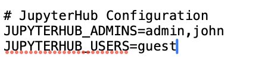{width="300"}

8.  Restart JupyterHub to take these changes into account

``` markdown
docker-compose restart jupyterhub
```

<!-- -->

9)  Use then the `make setup` command to initiate the datacube before using it. You can either simply type `make setup`, which will deploy the datacube with all layers available, or you can filter a specific area of interest using the BBOX parameter (e.g. `make setup BBOX=5.95,45.81,10.50,47.81`) and the DATETIME parameter specifying a particular time range (e.g. `make setup BBOX=5.95,45.81,10.50,47.81 DATETIME=2024-01-01/2024-12-31`)

Your Terminal should be showing activity

# **Web browser**

10. Go to [http://localhost/explorer/products](http://localhost/explorer/products){target="_blank"} to check if all is working fine. If it is the case, you should see an image like the one below

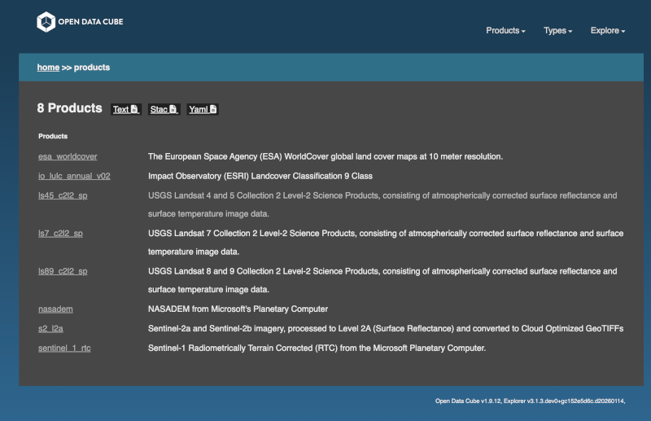

11. Go to [http://localhost/jupyter](http://localhost/jupyter){target="_blank"} and click on signup to create a new user corresponding to the one you have attributed the admin role in point 7.

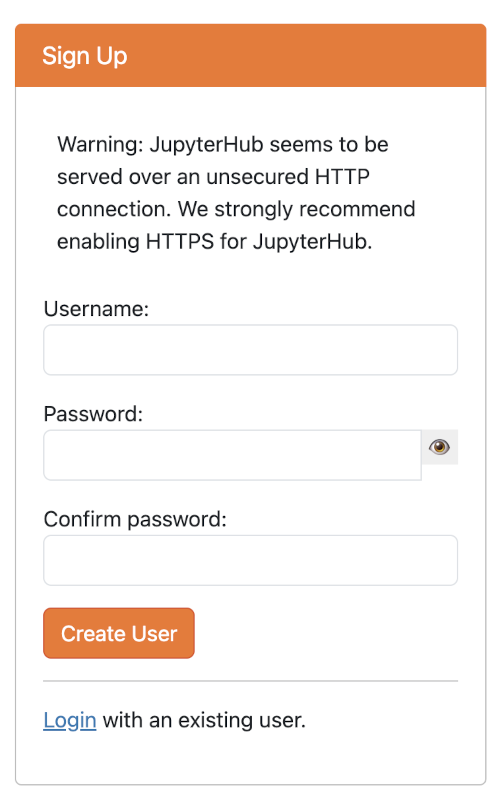{width="212"}

12. In the next screen, enter this user and give a password. If all works fine, you should see a confirmation message saying that the signup was successful.

::: callout-note
Do not forget to write down your username and password as these will be needed for later login for using the data cube
:::

13. On this same screen, click on the [login](http://localhost/jupyter/hub/login){target="_blank"} link and log in with the credentials you just created. If all works fine, you should reach in your browser the homepage of the JupyterHub interface of the Nostradamus datacube.

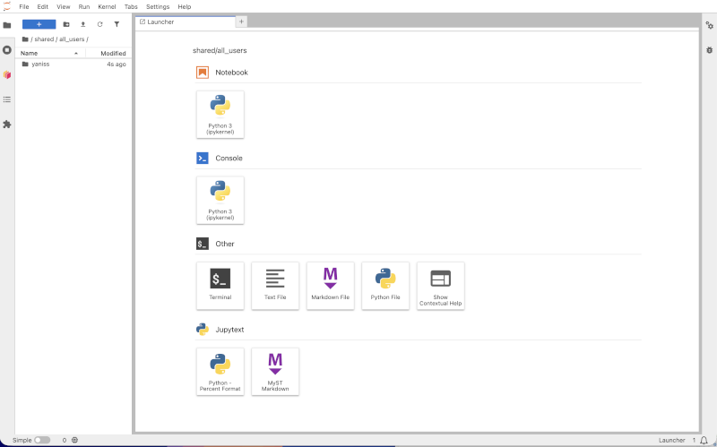

If you check your Docker desktop instance, a container with a name containing "cube-in-a-box" should be running.

::: callout-tip
the url to reach your the homepage of the JupyterHub interface of the Nostradamus datacube should be localhost/jupyter/user/\[username\]/lab
:::





# Nostradamus datacube use


1)  Launch Docker Desktop and verify that the containers "cube-in-a-box" and "cube-in-a-box-jupyter" have started (this should be automatic at the launch of Docker Desktop)

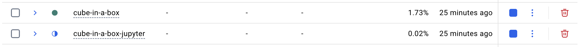

::: callout-note
You can also check in your Terminal that both Docker a Docker compose are running, using the following commands:

docker --version

docker compose version
:::

2.  Go to <http://localhost/jupyter/> and sign in with you credentials =\> Jupyter server will begin to spawn and the homepage should be ready after a few seconds


3.  By default, this homepage shows in the left sidebar your own folder. If it is the first time you are using the datacube, your folder should be empty (you can double-click on it to check). On the other hand, if you navigate to */shared/**notebooks_demo*** (by clicking on the tree at the top of the left sidebar) you will see the available demo jupyter notebooks.

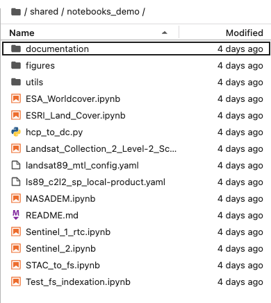


4.  Double-clicking on a notebook will open it (in read only) and give you the following information:

-   **Objective** of the notebook

-   **Products** used

-   **Data source**

-   **Background**

-   **Description**

::: callout-note
-   You can edit and execute .ipynb files directly in the ./shared/notebooks_demo directory, but not save any changes.
-   To save any changes, copy the notebook and any potential dependent files to your root directory first (or shared personal directory).
- The content of the root directory is not visible by others while the one of your your folder is, but only you can edit it. 
:::

5.  In order to use these demo notebooks and make changes, you need to copy them into the Jupyter root directory. To do so, right clik on the notebook of interest and its dependencies (folders documentation, figures, utils) in the "notebooks_demo" folder and paste it at the root directory. It should then appear at the same level as the "shared" folder. Alternatively, you can also copy the whole "notebooks_demo" folder to the root directory.

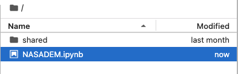

6.  In order to run a notebook, you have pasted in the root directory, double-click on it, which will open a new tab in teh JupyterLab session with specific tools in the menu bar of the tab. The blue bar on the left shows which cell is selected to be run. In order to process the cell in question, click on the play arrow (titled "run this cell and advance") or click on shift+enter of your keyboard.

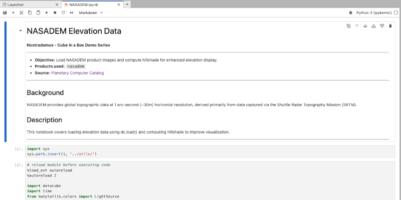





# Exercices


This section contains dedicated exercices to become familiar with the use of Nostradamus datacube.





# How to index new data into a DC?


Once a datacube is deployed, the Earth observation archive keeps growing: new satellite scenes become available over time and need to be added to the existing index so they can be queried and analysed alongside the rest of the archive. Since the Nostradamus datacube uses a [**STAC datastore**](stac_datastore.qmd){target="_blank"} (the Planetary Computer catalog) as its data source, new scenes do not need to be prepared or described by hand: they can be indexed directly from the STAC catalog into an existing product.

In short, the procedure consists of searching the STAC catalog for new scenes matching a product, an area of interest, and a date range, then registering the matching STAC items into the corresponding [**ODC product**](landsat.qmd){target="_blank"} already configured in the cube. This is done with the `stac-to-dc` command-line tool (part of [**odc-apps-dc-tools**](https://github.com/opendatacube/odc-tools/tree/develop/apps/dc_tools){target="_blank"}), which is already installed in the Nostradamus JupyterHub environment. Once indexed, the new scenes are immediately visible in the ODC Explorer and loadable through the Python API, exactly like the rest of the archive.

The steps below index new Landsat Collection 2 Level-2 scenes into the existing `lsX_c2l2_sp` product (see the [**Landsat**](landsat.qmd){target="_blank"} page) as a concrete example.

1.  Open a **Terminal** in the Nostradamus JupyterHub (File \> New \> Terminal), where `datacube` and `stac-to-dc` are already available.

2.  Check that the target product is already registered in the cube:

    ``` markdown
    datacube product list | grep lsX_c2l2_sp
    ```

3.  Search the Planetary Computer STAC catalog for new scenes and index them directly into that product, specifying the collection, an area of interest (bounding box), and a date range:

    ``` markdown
    stac-to-dc \
      --catalog-href="https://planetarycomputer.microsoft.com/api/stac/v1/" \
      --collections="landsat-c2-l2" \
      --bbox="5.95,45.81,10.50,47.81" \
      --datetime="2026-01-01/2026-06-30" \
      --rename-product="lsX_c2l2_sp" \
      --update-if-exists
    ```

    `--rename-product` maps the STAC collection (`landsat-c2-l2`) to the existing ODC product name (`lsX_c2l2_sp`), and `--bbox`/`--datetime` restrict the search to the area and period you need (adjust them to your own area of interest).

::: callout-note
Planetary Computer assets are served through short-lived signed URLs. If loading newly indexed scenes later fails with an access error, see the [**STAC datastore**](stac_datastore.qmd){target="_blank"} page for how signing is handled, or re-run the indexing step to refresh the references.
:::

4.  Check the command's output: it reports how many datasets were **added**, **failed**, and **skipped** (already-indexed scenes are skipped, not duplicated).

5.  Confirm the new scenes are indexed by checking the product's extent in the ODC Explorer, at [localhost/explorer/products/lsX_c2l2\_sp](http://localhost/explorer/products/lsX_c2l2_sp){target="_blank"}: the temporal coverage should now include your new date range.

6.  Alternatively, confirm it directly from a notebook using the Python API:

    ``` python
    from datacube import Datacube

    dc = Datacube(app="check-new-data")
    data = dc.load(product="lsX_c2l2_sp", time=("2026-01-01", "2026-06-30"))
    print(data.time.values)
    ```





# Exercice2


Exercice2





# Workshops


This section contains material for all the Nostradamus workshops.





# Workshop Nostradamus Task 6.3


In the frame of the Nostradamus 6.3, it is planned to co-design and implement comprehensive (online) training activities and materials tailored to different target groups to foster the knowledge, skills and capacity of key stakeholders.

This section contains all the Nostradamus related datacube available to this task.





# Vector datacubes


This section is dedicated to vector datacubes material.





# Vector datacube installation


Description of data cube concepts





# Data sources


The Nostradamus datacube contains analysis ready datasets that allow to perform analyses through [6 distinct notebooks](https://git.unepgrid.ch/NOSTRADAMUS/cube-in-a-box-jupyter/src/branch/main/products) that use different data sources:

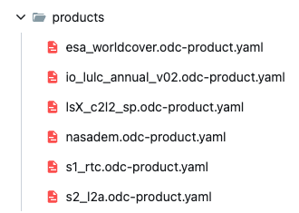

-   [esa_worldcover.odc-product.yaml](https://git.unepgrid.ch/NOSTRADAMUS/cube-in-a-box-jupyter/src/branch/main/products/esa_worldcover.odc-product.yaml):

-   [io_lulc_annual_v02.odc-product.yaml](https://git.unepgrid.ch/NOSTRADAMUS/cube-in-a-box-jupyter/src/branch/main/products/io_lulc_annual_v02.odc-product.yaml "io_lulc_annual_v02.odc-product.yaml")

-   [lsX_c2l2_sp.odc-product.yaml](https://git.unepgrid.ch/NOSTRADAMUS/cube-in-a-box-jupyter/src/branch/main/products/lsX_c2l2_sp.odc-product.yaml): more information about Landsat product [here](landsat.qmd)

-   [nasadem.odc-product.yaml](https://git.unepgrid.ch/NOSTRADAMUS/cube-in-a-box-jupyter/src/branch/main/products/nasadem.odc-product.yaml)

-   [s1_rtc.odc-product.yaml](https://git.unepgrid.ch/NOSTRADAMUS/cube-in-a-box-jupyter/src/branch/main/products/s1_rtc.odc-product.yaml)

-   [s2_l2a.odc-product.yaml](https://git.unepgrid.ch/NOSTRADAMUS/cube-in-a-box-jupyter/src/branch/main/products/s2_l2a.odc-product.yaml)





# Landsat


## Landsat images

Landsat is an Earth observation satellite programme that operates dedicated satellites continuously since 1972 through 9 Landsat programmes.

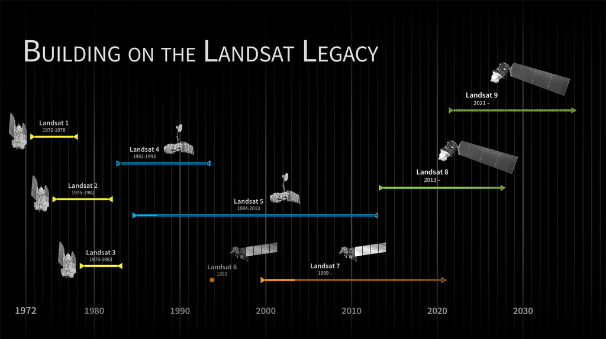

## Landsat collections

The Landsat archive of raw and processed data since 1972 is organized into 3 collections:

-   **Pre-collection** (before 2016): old on-demand processing system, no longer available

-   **Collection 1** (2016-2022): tiered collection management structure, ensuring that all Landsat Level-1 products provide a consistent archive of known data quality to support time-series analyses and data "stacking". No longer available

-   **Collection 2** (2022-present): reprocessing of the Collection 1 archive resulting in several product improvements that harness recent advancements in data processing, algorithm development, and data access and distribution capabilities: alignment of the pixels, sensors value coherence, metadata quality, etc to have a more accurate product

## Landsat levels

**Each collection** organises data into **levels** **of processing**:

-   **Level1 (L1)**: raw data corrected for geometry and topography

-   **Level2 (L2)**: L1 images are taken as the basis, on which physical values of the atmosphere (aerosols, ozone, water vapor, …) are corrected =\> ready data for certain analyses (indices calculation, multi-temporal series, etc.) that could not be done with L1 images

-   **Level3 (L3)**: analytical derived products from L2, that are automatically generated

Among the various products available in the Nostradamus datacube, the one called "[**lsX_c2l2_sp.odc-product.yaml**](https://git.unepgrid.ch/NOSTRADAMUS/cube-in-a-box-jupyter/src/branch/main/products/lsX_c2l2_sp.odc-product.yaml)**"** is the Landsat one, made of USGS Landsat 8 and 9 Collection 2 Level-2 Science Products, consisting of atmospherically corrected surface reflectance and surface temperature image data.





# Sentinel


## Sentinel





# Planetary computer


It is a data catalog containing environmental monitoring data, in consistent, analysis-ready formats accessible from Azure Blob Storage. [Access it from here](https://planetarycomputer.microsoft.com/catalog) .

Data layers are categorized into 18 categories to facilitiate their discoverability.

To access planetary computer data, there is a need to be registered. In order to automatize the process of login, a «sign_url» function has been developed and added into the Nostradamus customized cube in a box.

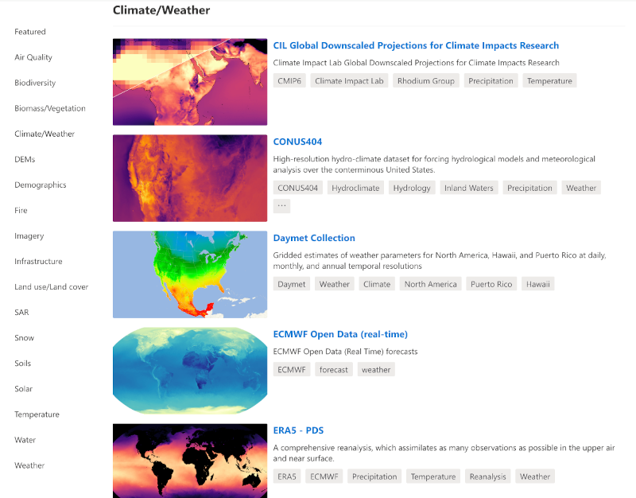





# Jupyter


[Jupyter](https://jupyter.org/){target="_blank"} is an open-source project that supports interactive data science and scientific computing across all programming languages. The Jupyter ecosystem is made of several [subprojects](https://docs.jupyter.org/en/latest/#sub-project-documentation){target="_blank"} that propose many different software.

Among them, [Jupyter notebook](https://jupyter-notebook.readthedocs.io/en/latest/){target="_blank"}, [JupyterLab](https://github.com/jupyterlab/jupyterlab){target="_blank"} and [JupyterHub](https://jupyterhub.readthedocs.io/en/latest/){target="_blank"} are relevant for the use of the Nostradamus datacube.

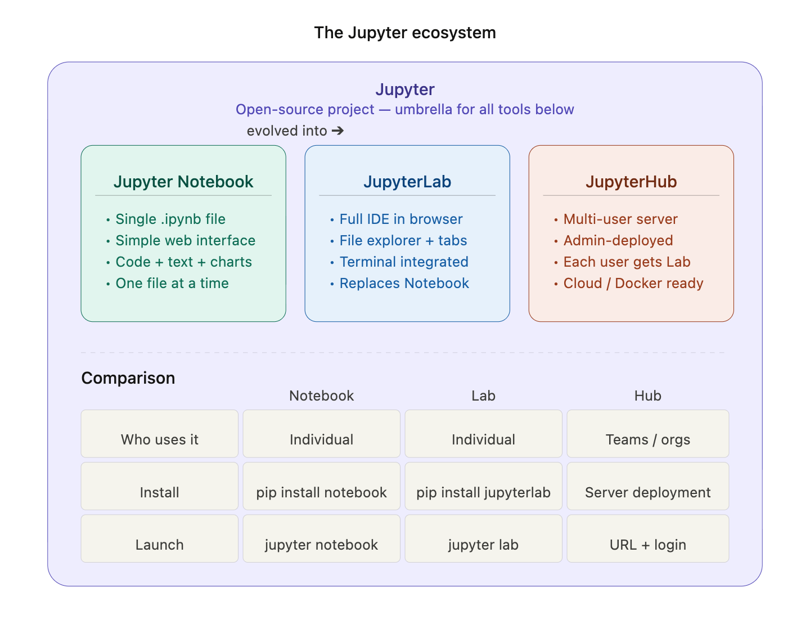

## Jupyter notebook

A [Jupyter notebook](https://jupyter-notebook.readthedocs.io/en/latest/){target="_blank"} is an interactive document with that is run in your web broswer and allows to have in a single **.ipynb** file:

- executable **code** (Python, R, ...) that can be run cell by cell
- formatted **text** in MarkDown language
- **visualisations** (graphs, maps, tables) that interactively display below the code

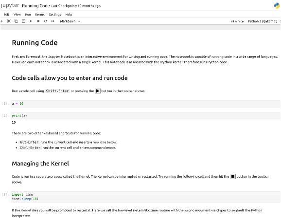

#### **How to install it on my machine?**

Type the following command in your Terminal:

``` markdown
pip install notebook
```

Note: in some cases you might need to write

``` markdown
pip3 install notebook
```

#### **How to know if it is installed on my machine?**

Type the following command in your Terminal:

``` markdown
jupyter --version
```

If it is installed, you should see its version

If it is not installed, you will see a message like "command not found".

#### **How to launch it?**

Type the following command in your Terminal:

``` markdown
jupyter notebook
```

This should open you navigator at http://localhost:8888.

#### **How to use it?**

Once you navigator is open at http://localhost:8888, use the top menus to either create new .ipynb file or open an existing one.

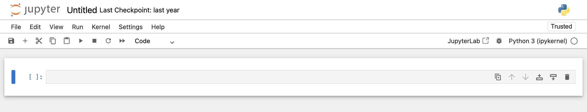

## Jupyterlab

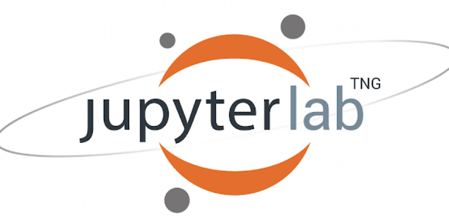{width="70px"}

[JupyterLab](https://github.com/jupyterlab/jupyterlab){target="_blank"} is the modern version of Jupyter notebooks. It is a full environment that contains more features than Jupyter notebooks. Here are some additional elements compared to Jupyter notebooks:

- multi-tabs
- Integrated file explorer
- Text and code editor
- Integrated terminal
- Extensions

#### **How to install it on my machine?**

There are 2 main options to have Jupyterlab on your machine: (A) either as a desktop application or (B) using your web browser

**(A) Installation of Jupyterlab Desktop**

Go to [https://github.com/jupyterlab/jupyterlab-desktop](https://github.com/jupyterlab/jupyterlab-desktop){target="_blank"} and download the application corresponding to your operating system

::: callout-caution
Since August 2025, Jupyter desktop is not actively maintained and does not receive security bug fixes
:::

**(B) Installation of Jupyterlab**

Type the following command in your Terminal:

``` markdown
pip install jupyterlab
```

Note: in some cases you might need to write

``` markdown
pip3 install jupyterlab
```

#### **How to know if it is installed on my machine?**

Type the following command in your Terminal:

``` markdown
jupyter lab --version
```

If it is installed, you should see its version

#### **How to launch it?**

Type the following command in your Terminal:

``` markdown
jupyter lab
```

This should open the Jupyterlab environment in your broswer at <http://localhost:8888/lab>

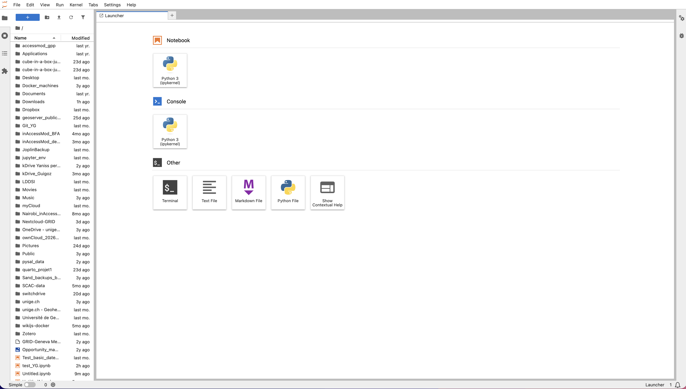

#### **How to use it?**

Once you navigator is open at http://localhost:8888/lab, use the various menus to navigate through your files and folders and to create new ones.

## JupyterHub

{width="70px"}

[JupyterHub](https://jupyterhub.readthedocs.io/en/latest/){target="_blank"} is a **multi-users server**, allowing each member of a team to access his/her own JupyterLab environment

#### **How to access a JupyterHub instance?**

There should normally be 2 options:

- Either your sysadmin has installed JupyterHub on a server and you can access it through a url and login
- or a self-hosted JupyterHub Docker image has been created and each user can use it as an isolated environment

This **Docker solution** is what has been chosen for the **Nostradamus JupyterHub**.





# LivingEarth


LivingEarth is ...

See <https://livingearthlab.github.io/> for more details





# Acknowledgments


## Funding sources

List of funding sources that supported the work.

## Contributions

Description of the contributions that help building this instance: Nostradamus, MonaLisa, ...

## Publications

List of publications linked to the data cubes presented in this capacity building instance

## AI assistance

During the preparation of this site, the authors used AI-based tools (large language models) to help draft and edit some sections of the documentation, including language editing and improving clarity. All AI-assisted content was reviewed, verified, and edited by the authors, who take full responsibility for the accuracy and content of this site. The technical implementation, data cube design, and content structure were directed and validated solely by the authors.





# Frequently Asked Questions


### When I have installed Docker and clicked on `make setup`I have a "404 page not found" in the browser at localhost/lab

### When launching the "make setup" command at the end of the installation process, I have message saying "Error: .env file not found!"

The first time you want to use the datacube after the installation, there is a need to set up a personnal .env file that contains the environment variables. To do so, you need to copy the existing default .env file and modify it for your own environment. Follow the procedure of the [Nostradamus datacube installation](nostradamus_datacube_setup.qmd) page starting from point 5.
