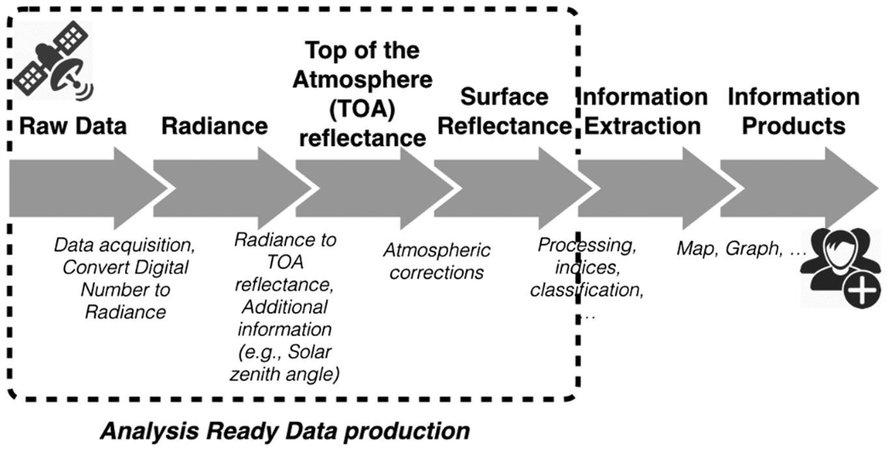

## Open Data Cube (ODC)

A **free, open-source software package that simplifies the management and analysis of large amounts of satellite imagery and other Earth observation data**. It allows users to easily access, process, and analyze decades of geographical data to track changes on Earth's surface over time.

[https://www.opendatacube.org](https://www.opendatacube.org/)

## Cube in a Box

A **simple way to run an Open Data Cube**, packaged as a ready-to-deploy environment (typically via Docker) that bundles the ODC software stack, a database, and example notebooks so users can get a working data cube up and running quickly, without a full manual installation.

<https://github.com/opendatacube/cube-in-a-box>

## STAC

**SpatioTemporal Asset Catalog (STAC)** is a common specification for describing geospatial data (satellite imagery, aerial imagery, and other Earth observation data) in a way that makes it easily searchable and interoperable across catalogues, tools, and platforms. A STAC catalogue organizes data into *Items* (individual assets with spatial/temporal metadata) grouped into *Collections*, all described using a standardized JSON schema.

<https://stacspec.org>

## Cloud Optimized GeoTIFF

**Cloud Optimized GeoTIFF (COG)** is a regular GeoTIFF file, aimed at being hosted on a cloud storage service (e.g., object storage such as AWS S3 or Azure Blob Storage), whose internal organization (tiling, overviews) enables efficient partial reads via HTTP range requests. This means clients can access only the portion of the image they need without downloading the entire file, which is essential for scalable, on-demand access to large Earth Observation datasets.

<https://www.cogeo.org>

## Analysis Ready Data

**Analysis Ready Data (ARD)** refers to satellite (or other remote sensing) data that has been processed to a minimum set of requirements — such as geometric correction, atmospheric correction, and consistent formatting — so that it can be used directly for analysis with minimal additional preprocessing. ARD reduces the technical burden on end users and improves comparability and interoperability across datasets, sensors, and time periods.

## Common Workflow Language

**Common Workflow Language (CWL)** is an open standard for describing analysis workflows and tools in a way that makes them portable and scalable across different software and hardware environments (e.g., workstations, clusters, cloud platforms). CWL is commonly used to package and execute Earth Observation processing pipelines in a reproducible, containerized manner.

<https://www.commonwl.org>

## REST

**Representational State Transfer (REST)** is an architectural style for designing networked, web-based APIs. A REST API exposes resources (e.g., datasets, catalogue entries, processing results) through standard HTTP methods (GET, POST, PUT, DELETE) and uniform, predictable URLs, typically exchanging data in formats such as JSON. REST APIs are widely used to enable interoperable, machine-readable access to data and services, including within data cube and STAC-based infrastructures.
