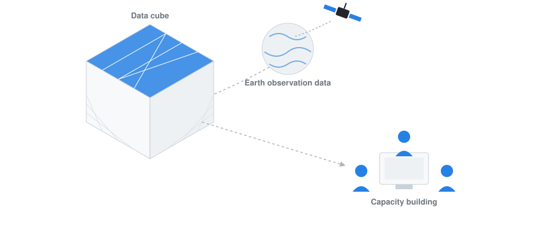

This site is a capacity-building resource on data cubes and Earth observation, developed by UNIGE and UNEP/GRID-Geneva. It introduces the core concepts behind data cubes — what problem they solve, how they organise satellite and geospatial data, and the main steps involved in setting one up — before walking through a concrete, hands-on implementation.

At its core is the Nostradamus datacube, a modified Open Data Cube deployment with a multi-user JupyterHub, an integrated STAC datastore, and ready-to-use notebooks. The site documents how to install and use it, complemented by step-by-step tutorials, recorded workshops, and a parallel section on vector datacubes for non-raster geospatial data.

Beyond the datacube itself, the site catalogues the underlying data sources (Landsat, Sentinel, the Planetary Computer STAC catalog) and the tools used to work with them (Jupyter, LivingEarth), along with acknowledgments and a FAQ for troubleshooting. Use the sidebar to navigate by topic, or start with the [**Introduction to datacubes**](dc_overview.qmd){target="_blank"} for a general overview before diving into the Nostradamus-specific material.
