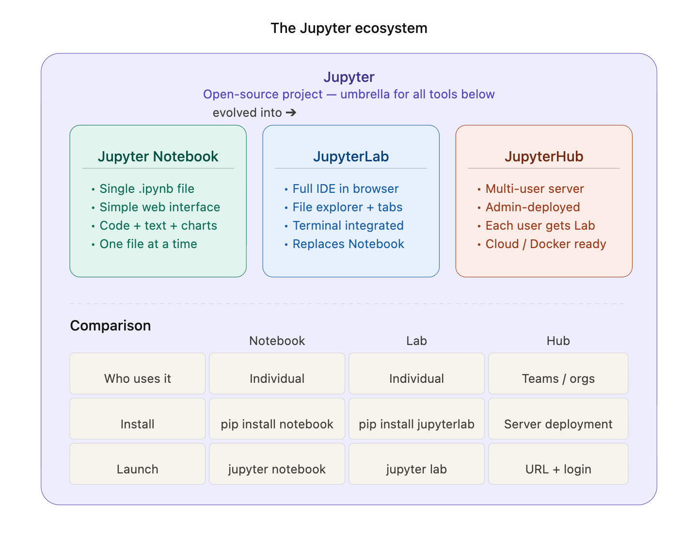
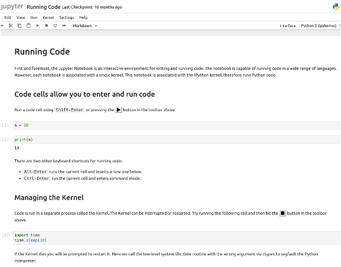
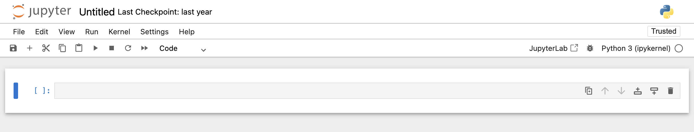
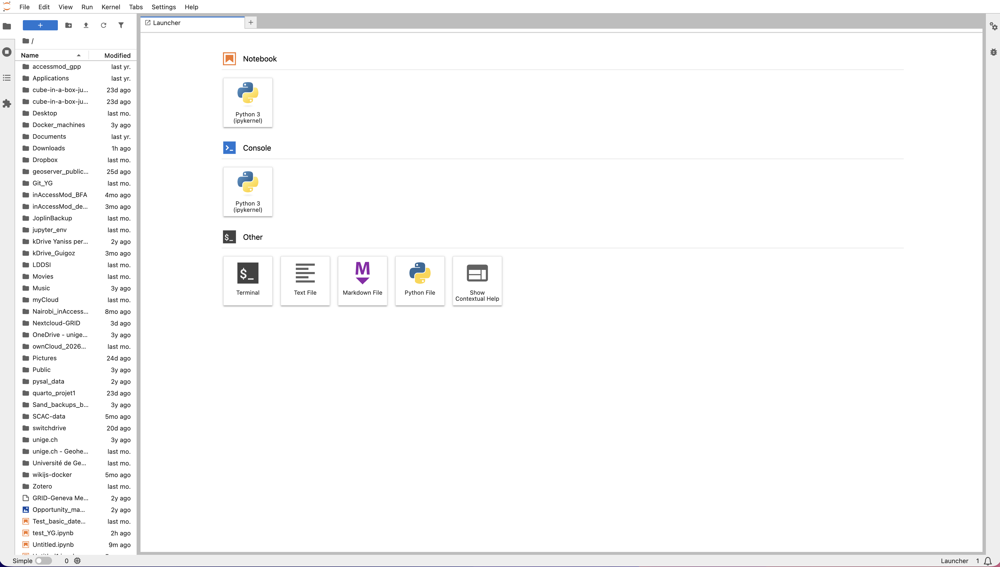

[Jupyter](https://jupyter.org/){target="_blank"} is an open-source project that supports interactive data science and scientific computing across all programming languages. The Jupyter ecosystem is made of several [subprojects](https://docs.jupyter.org/en/latest/#sub-project-documentation){target="_blank"} that propose many different software.

Among them, [Jupyter notebook](https://jupyter-notebook.readthedocs.io/en/latest/){target="_blank"}, [JupyterLab](https://github.com/jupyterlab/jupyterlab){target="_blank"} and [JupyterHub](https://jupyterhub.readthedocs.io/en/latest/){target="_blank"} are relevant for the use of the Nostradamus datacube.



## Jupyter notebook

A [Jupyter notebook](https://jupyter-notebook.readthedocs.io/en/latest/){target="_blank"} is an interactive document with that is run in your web broswer and allows to have in a single **.ipynb** file:

-   executable **code** (Python, R, ...) that can be run cell by cell
-   formatted **text** in MarkDown language
-   **visualisations** (graphs, maps, tables) that interactively display below the code



#### **How to install it on my machine?**

Type the following command in your Terminal:

``` markdown
pip install notebook
```

Note: in some cases you might need to write

``` markdown
pip3 install notebook
```

#### **How to know if it is installed on my machine?**

Type the following command in your Terminal:

``` markdown
jupyter --version
```

If it is installed, you should see its version

If it is not installed, you will see a message like "command not found".

#### **How to launch it?**

Type the following command in your Terminal:

``` markdown
jupyter notebook
```

This should open you navigator at http://localhost:8888.

#### **How to use it?**

Once you navigator is open at http://localhost:8888, use the top menus to either create new .ipynb file or open an existing one.



## Jupyterlab

{width="70px"}

[JupyterLab](https://github.com/jupyterlab/jupyterlab){target="_blank"} is the modern version of Jupyter notebooks. It is a full environment that contains more features than Jupyter notebooks. Here are some additional elements compared to Jupyter notebooks:

-   multi-tabs
-   Integrated file explorer
-   Text and code editor
-   Integrated terminal
-   Extensions

#### **How to install it on my machine?**

There are 2 main options to have Jupyterlab on your machine: (A) either as a desktop application or (B) using your web browser

**(A) Installation of Jupyterlab Desktop**

Go to [https://github.com/jupyterlab/jupyterlab-desktop](https://github.com/jupyterlab/jupyterlab-desktop){target="_blank"} and download the application corresponding to your operating system

::: callout-caution
Since August 2025, Jupyter desktop is not actively maintained and does not receive security bug fixes
:::

**(B) Installation of Jupyterlab**

Type the following command in your Terminal:

``` markdown
pip install jupyterlab
```

Note: in some cases you might need to write

``` markdown
pip3 install jupyterlab
```

#### **How to know if it is installed on my machine?**

Type the following command in your Terminal:

``` markdown
jupyter lab --version
```

If it is installed, you should see its version

#### **How to launch it?**

Type the following command in your Terminal:

``` markdown
jupyter lab
```

This should open the Jupyterlab environment in your broswer at <http://localhost:8888/lab>



#### **How to use it?**

Once you navigator is open at http://localhost:8888/lab, use the various menus to navigate through your files and folders and to create new ones.

## JupyterHub

{width="70px"}

[JupyterHub](https://jupyterhub.readthedocs.io/en/latest/){target="_blank"} is a **multi-users server**, allowing each member of a team to access his/her own JupyterLab environment

#### **How to access a JupyterHub instance?**

There should normally be 2 options:

-   Either your sysadmin has installed JupyterHub on a server and you can access it through a url and login
-   or a self-hosted JupyterHub Docker image has been created and each user can use it as an isolated environment

This **Docker solution** is what has been chosen for the **Nostradamus JupyterHub**.
