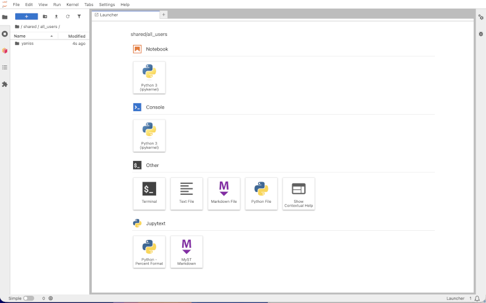
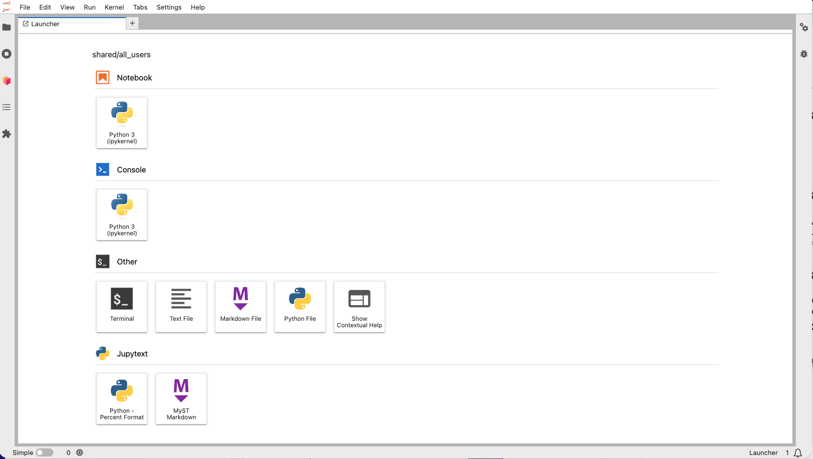
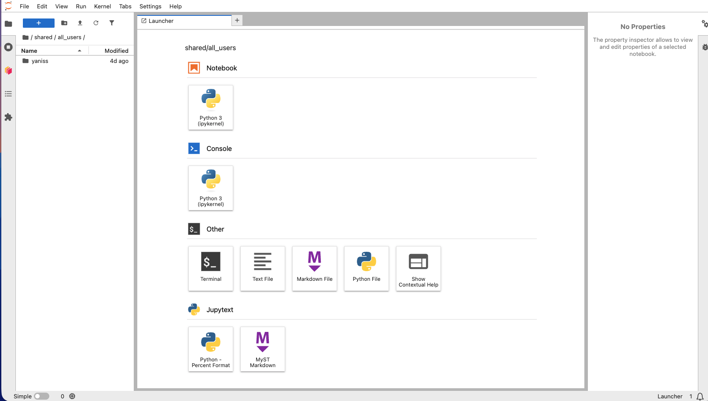

The [JupyterLab interface](https://jupyterlab.readthedocs.io/en/stable/user/interface.html) is made of several elements:

## Collapsible left and right sidebars

## Left sidebar elements

## Right sidebar elements

## Top menu bar

