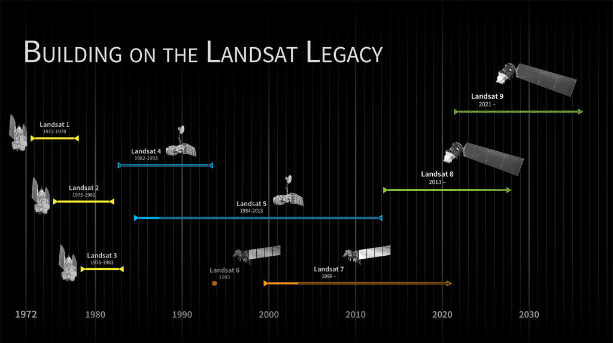

## Landsat images

Landsat is an Earth observation satellite programme that operates dedicated satellites continuously since 1972 through 9 Landsat programmes.

## Landsat collections

The Landsat archive of raw and processed data since 1972 is organized into 3 collections:

-   **Pre-collection** (before 2016): old on-demand processing system, no longer available

-   **Collection 1** (2016-2022): tiered collection management structure, ensuring that all Landsat Level-1 products provide a consistent archive of known data quality to support time-series analyses and data "stacking". No longer available

-   **Collection 2** (2022-present): reprocessing of the Collection 1 archive resulting in several product improvements that harness recent advancements in data processing, algorithm development, and data access and distribution capabilities: alignment of the pixels, sensors value coherence, metadata quality, etc to have a more accurate product

## Landsat levels

**Each collection** organises data into **levels** **of processing**:

-   **Level1 (L1)**: raw data corrected for geometry and topography

-   **Level2 (L2)**: L1 images are taken as the basis, on which physical values of the atmosphere (aerosols, ozone, water vapor, …) are corrected =\> ready data for certain analyses (indices calculation, multi-temporal series, etc.) that could not be done with L1 images

-   **Level3 (L3)**: analytical derived products from L2, that are automatically generated

Among the various products available in the Nostradamus datacube, the one called "[**lsX_c2l2_sp.odc-product.yaml**](https://git.unepgrid.ch/NOSTRADAMUS/cube-in-a-box-jupyter/src/branch/main/products/lsX_c2l2_sp.odc-product.yaml)**"** is the Landsat one, made of USGS Landsat 8 and 9 Collection 2 Level-2 Science Products, consisting of atmospherically corrected surface reflectance and surface temperature image data.
