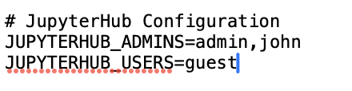
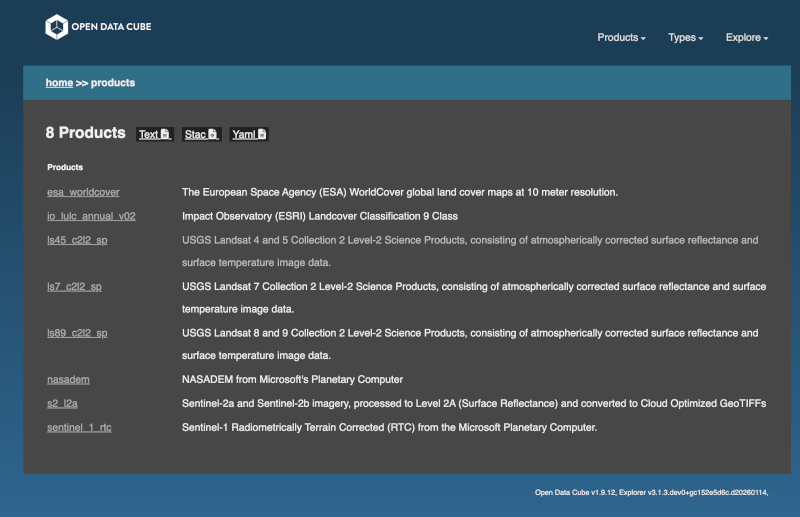
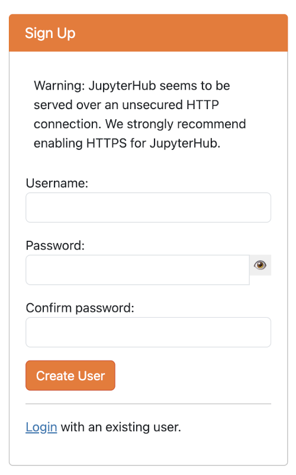

::: callout-note
A [detailed installation procedure](https://github.com/LivingEarthLab/cube-in-a-box){target="_blank"} and other [admin](https://github.com/LivingEarthLab/cube-in-a-box/blob/main/docs/admin/Living-Earth-Cube-in-a-Box---Admin-Guide.pdf){target="_blank"} and [user](https://github.com/LivingEarthLab/cube-in-a-box/blob/main/docs/user/Living-Earth-Cube-in-a-Box---User-Guide.pdf){target="_blank"} tutorials exist. The steps below consist in additional help to the links mentioned for a Docker install of the Nostradamus data cube
:::

# **Docker**

1)  Install [Docker desktop](https://www.docker.com/products/docker-desktop){target="_blank"} for your operating system and launch it

2)  To make sure all works fine, type the following commands in your Terminal (example on Mac OS):

``` markdown
docker –-version 
```

and

``` markdown
docker compose version
```

If corresponding information is returned, it means all is working fine for your Docker session and you can proceed to the next steps

::: callout-caution
At this stage, don't start yet any Docker container
:::

# **Terminal**

3)  Clone the Nostradamus jupyter cube into your local Docker application by typing the following command:

``` markdown
git clone https://git.unepgrid.ch/NOSTRADAMUS/cube-in-a-box-jupyter.git
```

This will create a cube-in-a-box-jupyter folder with all the necessary Docker files. In case the folder already exists, use the pull command (more info in the [FAQ](faq.qmd){target="_blank"} page)

4)  Once the installation is finalized, go to the newly created folder by typing in your Terminal

``` markdown
cd cube-in-a-box-jupyter
```

5)  After a first install, you need to setup the environment variables (in the .env file). To do so, you need first to copy the existing default .env file by typing

``` markdown
cp .env.default .env
```

6)  As both the original .env.default and copied .env files are hidden files, you need to activate the hidden files display in your system (e.g. Cmd + Shift + . in Mac finder)

7)  Open then the .env file you copied (for example in a text editor) and add a user (for example your first name) with an admin role in the line JUPYTERHUB_ADMINS, adding a comma after "admin"

{width="300"}

8.  Restart JupyterHub to take these changes into account

``` markdown
docker-compose restart jupyterhub
```

<!-- -->

9)  Use then the `make setup` command to initiate the datacube before using it. You can either simply type `make setup`, which will deploy the datacube with all layers available, or you can filter a specific area of interest using the BBOX parameter (e.g. `make setup BBOX=5.95,45.81,10.50,47.81`) and the DATETIME parameter specifying a particular time range (e.g. `make setup BBOX=5.95,45.81,10.50,47.81 DATETIME=2024-01-01/2024-12-31`)

Your Terminal should be showing activity

# **Web browser**

10. Go to [http://localhost/explorer/products](http://localhost/explorer/products){target="_blank"} to check if all is working fine. If it is the case, you should see an image like the one below



11. Go to [http://localhost/jupyter](http://localhost/jupyter){target="_blank"} and click on signup to create a new user corresponding to the one you have attributed the admin role in point 7.

{width="212"}

12. In the next screen, enter this user and give a password. If all works fine, you should see a confirmation message saying that the signup was successful.

::: callout-note
Do not forget to write down your username and password as these will be needed for later login for using the data cube
:::

13. On this same screen, click on the [login](http://localhost/jupyter/hub/login){target="_blank"} link and log in with the credentials you just created. If all works fine, you should reach in your browser the homepage of the JupyterHub interface of the Nostradamus datacube.


If you check your Docker desktop instance, a container with a name containing "cube-in-a-box" should be running.

::: callout-tip
the url to reach your the homepage of the JupyterHub interface of the Nostradamus datacube should be localhost/jupyter/user/\[username\]/lab
:::
