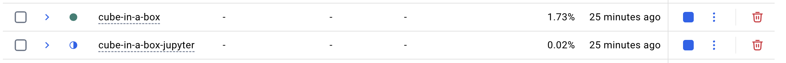
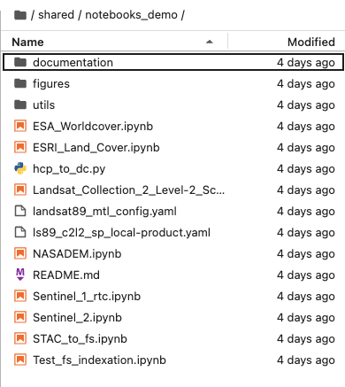
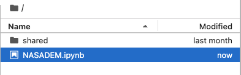
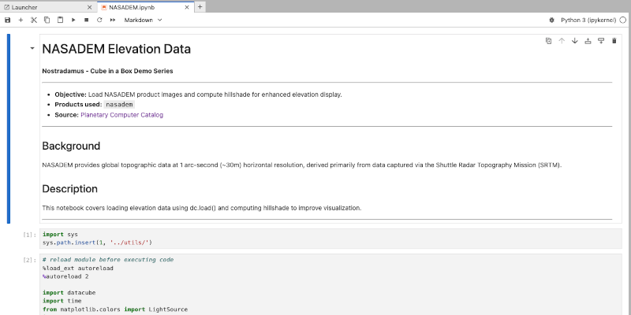

1)  Launch Docker Desktop and verify that the containers "cube-in-a-box" and "cube-in-a-box-jupyter" have started (this should be automatic at the launch of Docker Desktop)

::: callout-note
You can also check in your Terminal that both Docker a Docker compose are running, using the following commands:

docker --version

docker compose version
:::

2.  Go to <http://localhost/jupyter/> and sign in with you credentials =\> Jupyter server will begin to spawn and the homepage should be ready after a few seconds

3.  By default, this homepage shows in the left sidebar your own folder. If it is the first time you are using the datacube, your folder should be empty (you can double-click on it to check). On the other hand, if you navigate to */shared/**notebooks_demo*** (by clicking on the tree at the top of the left sidebar) you will see the available demo jupyter notebooks.

4.  Double-clicking on a notebook will open it (in read only) and give you the following information:

-   **Objective** of the notebook

-   **Products** used

-   **Data source**

-   **Background**

-   **Description**

::: callout-note
-   You can edit and execute .ipynb files directly in the ./shared/notebooks_demo directory, but not save any changes.
-   To save any changes, copy the notebook and any potential dependent files to your root directory first (or shared personal directory).
- The content of the root directory is not visible by others while the one of your your folder is, but only you can edit it. 
:::

5.  In order to use these demo notebooks and make changes, you need to copy them into the Jupyter root directory. To do so, right clik on the notebook of interest and its dependencies (folders documentation, figures, utils) in the "notebooks_demo" folder and paste it at the root directory. It should then appear at the same level as the "shared" folder. Alternatively, you can also copy the whole "notebooks_demo" folder to the root directory.

6.  In order to run a notebook, you have pasted in the root directory, double-click on it, which will open a new tab in teh JupyterLab session with specific tools in the menu bar of the tab. The blue bar on the left shows which cell is selected to be run. In order to process the cell in question, click on the play arrow (titled "run this cell and advance") or click on shift+enter of your keyboard.

