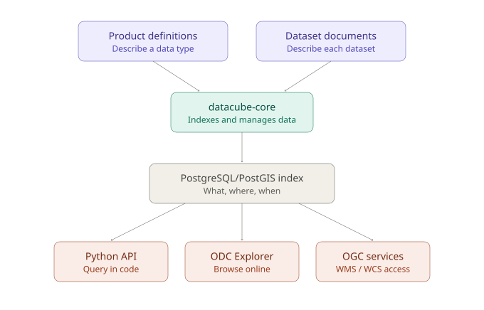

## What is the Open Data Cube?

The [**Open Data Cube (ODC)**](https://www.opendatacube.org/){target="_blank"} is an open-source software project that provides the core framework used to build data cubes: it turns collections of individual satellite scenes and other gridded data into an analysis-ready, queryable archive organised along space, time, and spectral dimensions. ODC is not a single hosted service, it is a set of libraries and tools that anyone can deploy on their own infrastructure, which is why it underpins many independent deployments worldwide, from national platforms such as [**Digital Earth Australia**](https://www.dea.ga.gov.au/){target="_blank"} and [**Digital Earth Africa**](https://www.digitalearthafrica.org/){target="_blank"} to project-specific instances such as the [**Nostradamus datacube**](nostradamus_datacube_intro.qmd){target="_blank"}.

## Core components

- **`datacube-core`** : the Python library and command-line tool at the heart of ODC. It manages the index (what data is available and where), handles product and dataset definitions, and provides the Python API used to load and analyse data.
- **PostgreSQL/PostGIS index**: the database that stores metadata about every indexed dataset (spatial extent, time, format, location of the underlying files). Indexing only records this metadata; the original data files are never copied or moved.
- **Product definitions and dataset documents**: YAML/JSON documents that describe, respectively, a *type* of data (e.g. a Landsat surface reflectance product) and each individual dataset to be indexed (its extent, time, measurements, and file paths).
- **ODC Explorer**: a web application for browsing what has been indexed: available products, spatial/temporal coverage, and dataset-level metadata.
- **Complementary tools**: including `datacube-ows` (OGC WMS/WMTS/WCS web services), `datacube-stats` (large-scale statistical summaries), and STAC-related tooling for interoperability with the wider Earth observation ecosystem.

## How the pieces fit together

A running ODC deployment is essentially the `datacube-core` software connected to a PostgreSQL/PostGIS database, with data indexed into it via product definitions and dataset documents. Once populated, the cube can be queried through the Python API, browsed through the Explorer, or served via OGC web services, all reading from the same underlying index.

{width="600"}

The [**Installation**](dc_installation.qmd){target="_blank"} and [**Quick Start**](dc_quickstart.qmd){target="_blank"} pages walk through setting this up step by step.

## Project and community

ODC is maintained as a community open-source project, with its source code, issue tracker, and documentation hosted on [**GitHub**](https://github.com/opendatacube){target="_blank"} and [**Read the Docs**](https://opendatacube.readthedocs.io/en/latest/){target="_blank"}. It is governed openly, with contributions from the agencies and research groups that operate the deployments listed above.
