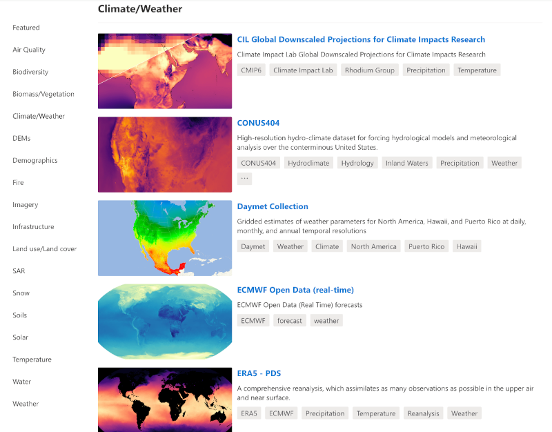

It is a data catalog containing environmental monitoring data, in consistent, analysis-ready formats accessible from Azure Blob Storage. [Access it from here](https://planetarycomputer.microsoft.com/catalog) .

Data layers are categorized into 18 categories to facilitiate their discoverability.

To access planetary computer data, there is a need to be registered. In order to automatize the process of login, a «sign_url» function has been developed and added into the Nostradamus customized cube in a box.

